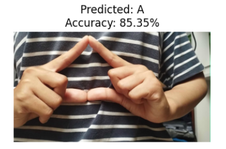
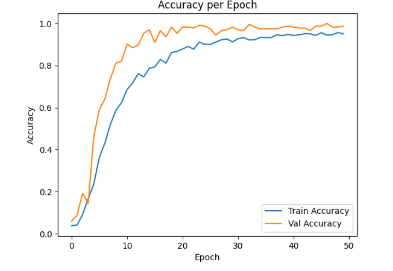
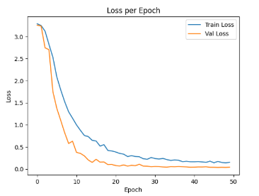

# 📚 Project Klasifikasi Gambar

Project ini adalah implementasi model klasifikasi menggunakan **TensorFlow** dan berbagai tools pendukung lainnya, termasuk konversi model ke **TensorFlow.js** dan **TensorFlow Lite (TFLite)** untuk keperluan deployment di web dan mobile.

## 🚀 Teknologi dan Library yang Digunakan
- **TensorFlow** — untuk membangun dan melatih model klasifikasi.
- **TensorFlow.js** — untuk mengkonversi model ke format yang bisa dijalankan di browser.
- **Splitfolders** — untuk membagi dataset menjadi data training, validation, dan testing.
- **Matplotlib** — untuk visualisasi data dan hasil pelatihan.
- **Numpy** — untuk pengolahan data numerik.
- **Seaborn** — untuk membuat visualisasi statistik seperti confusion matrix.
- **Scikit-learn** — untuk evaluasi model (classification report, confusion matrix, dll).
- **TFLite** — untuk mengkonversi model ke format ringan untuk perangkat mobile.

## 📂 Struktur Proyek
```plaintext
.
├── dataset/
│   ├── train/
│   ├── val/
│   └── test/
├── saved_model/
│   ├── assets/
│   ├── variables/
|   ├── fingerprint.pb
│   └── saved_model.pb
├── tfjs_model/
│   ├── group1-shard1of7.bin
│   ├── group1-shard2of7.bin
│   ├── group1-shard3of7.bin
│   ├── group1-shard4of7.bin
│   ├── group1-shard5of7.bin
│   ├── group1-shard6of7.bin
│   ├── group1-shard7of7.bin
│   └── model.json
├── tflite/
│   ├── label.txt
│   └── model.tflite
├── submission_klasifikasi_gambar.ipynb
├── README.md
└── requirements.txt
```

## 🧪 Langkah-langkah Penggunaan

### 1. Persiapkan Dataset
- Dataset dibagi menjadi train/validation/test menggunakan `splitfolders`.

### 2. Training Model
- Model dikembangkan menggunakan **TensorFlow**.
- Visualisasi akurasi dan loss dilakukan menggunakan **Matplotlib** dan **Seaborn**.

### 3. Evaluasi Model
- Evaluasi dilakukan menggunakan **Scikit-learn** untuk menghasilkan metrics seperti:
  - Accuracy
  - Precision
  - Recall
  - Confusion Matrix

### 4. Konversi Model
- Konversi ke **TensorFlow.js** menggunakan `tensorflowjs_converter`.
- Konversi ke **TFLite** menggunakan TensorFlow TFLite converter.
- Konversi ke **SavedModel** menggunakan Tensorflow model.export.

### 5. Interfece
- Model `.tflite` yang digunakan untuk interface
- 


## 🔧 Instalasi
Clone project ini lalu install semua dependencies:

```bash
git clone https://github.com/Sintasitinuriah/Klasifikasi_Gambar_BISINDO.git
cd Klasifikasi_Gambar_BISINDO
pip install -r requirements.txt
```

Atau install satu per satu:

```bash
pip install tensorflow tensorflowjs splitfolders matplotlib numpy seaborn scikit-learn
```

## 🖼️ Visualisasi




